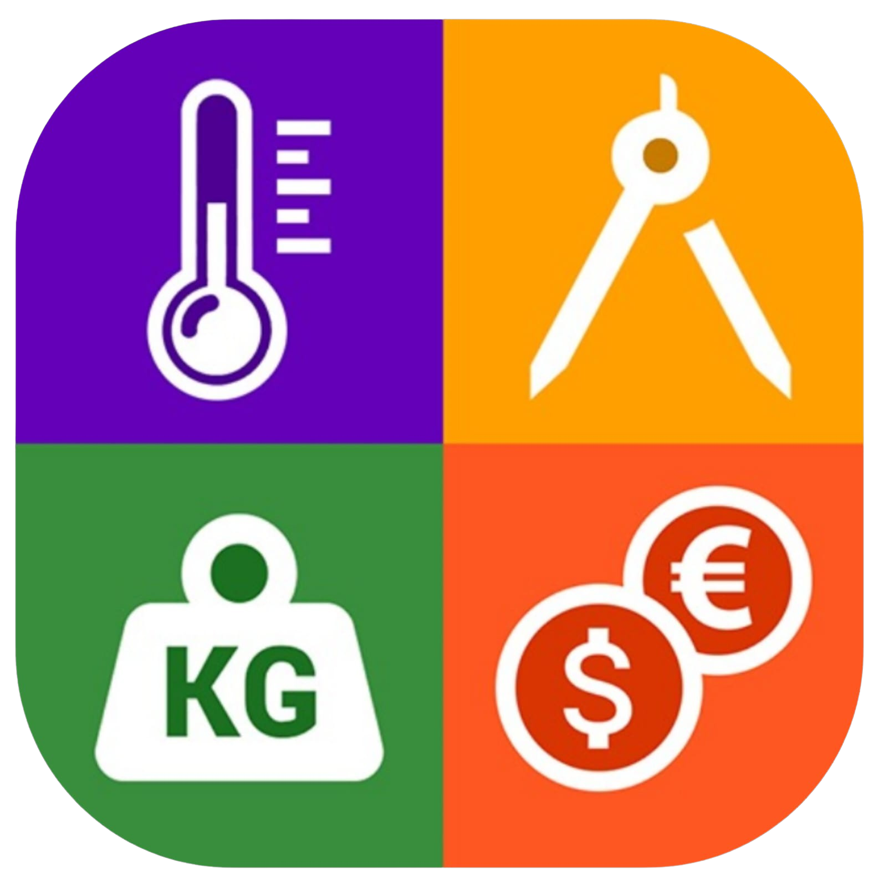
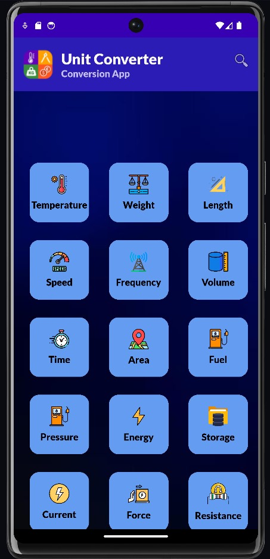
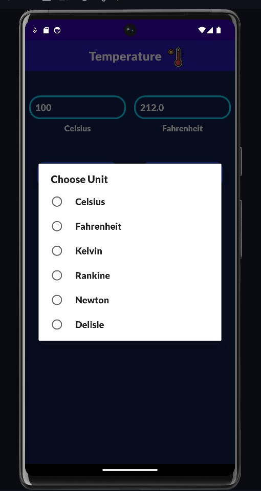
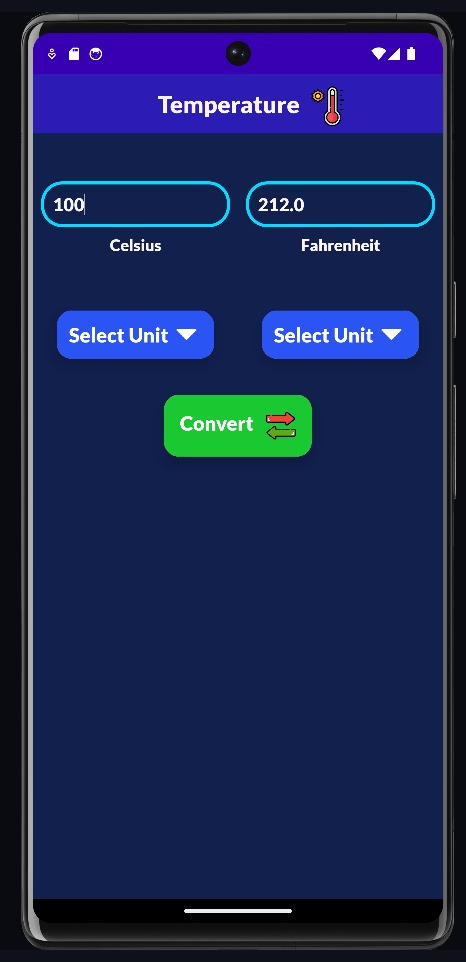
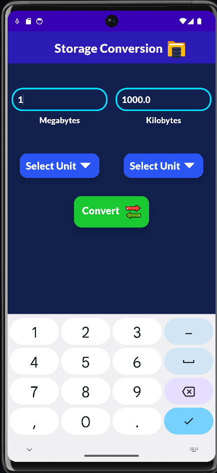
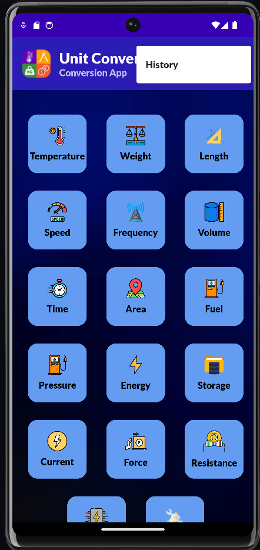
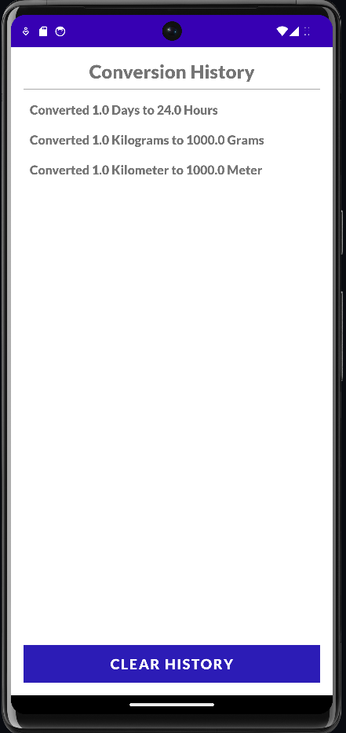
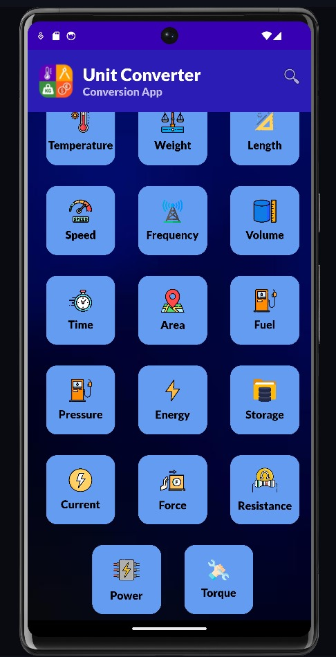

# Unit Converter App

    <h2>Unit Converter</h2>  
        
<strong>Made By Vighnesh Salunkhe!</strong>

  

## Overview

The Unit Converter App is a simple and intuitive Android application designed to convert various units of measurement. This project was developed as part of my internship and aims to provide users with an easy way to perform conversions between different units.

## Main Concepts
- **User-Friendly UI:** Intuitive design for easy navigation.
- **Conversion Logic:** Robust algorithms for multiple unit types (length, weight, temperature).

-**RecyclerView:** Efficiently displays the conversion history.
- **SharedPreferences:** Save and view past conversions using (History Feature).
- **Real-Time Feedback:** Instant conversion results as you input values.

## Features

- **Supports Multiple Unit Types**: Length, Weight, Temperature, etc.
- **User-friendly interface**: Simple design for easy navigation.
- **Real-time Conversion**: Instant feedback as users input values.
- **Conversion History**: View and manage your past conversions for easy reference.

- **Search Functionality**: Quickly find the unit you want to convert.
- **Custom Themes**: A visually appealing design with different themes.

## Technologies Used

- Android Studio
- Java
- XML for layout design

## Output Screenshots

    
    
    
    
     
     
     
    

## Video Demo
Watch the video for a demonstration of the app in action:
[Click to Watch Demo](Video/recording.mp4)

## Installation

1. **Open the project in Android Studio:**
    - Launch Android Studio.
    - Click on `File` -> `Open` and navigate to the cloned project directory.
    - Select the project to open it.

2. **Build the project:**
    - Click on `Build` -> `Make Project` or press `Ctrl+F9` to build the project.

3. **Run the app:**
    - Connect an Android device or start an emulator.
    - Click on `Run` -> `Run 'app'` or press `Shift+F10` to run the app.

## Usage
1. Open the app.
2. Select the type of conversion you want to perform.
3. Input the value you wish to convert.
4. View the converted value instantly.

## Contributing
Contributions are welcome! If you have suggestions for improvements or new features, feel free to fork the repository and submit a pull request.

## License
This project is licensed under the MIT License. See the LICENSE file for details.

## Acknowledgments
- Thank you to my mentors Darshan Sir & Shreya Mam for their guidance.
- Inspiration from online Google Meet Sessions,resources and tutorials.

## Contact
**For any inquiries, please reach out to me at:**

- **Email:** vighneshsalunkhe949@gmail.com
- **Project Link:** https://github.com/VighneshDevHub/Unit-Converter-App
