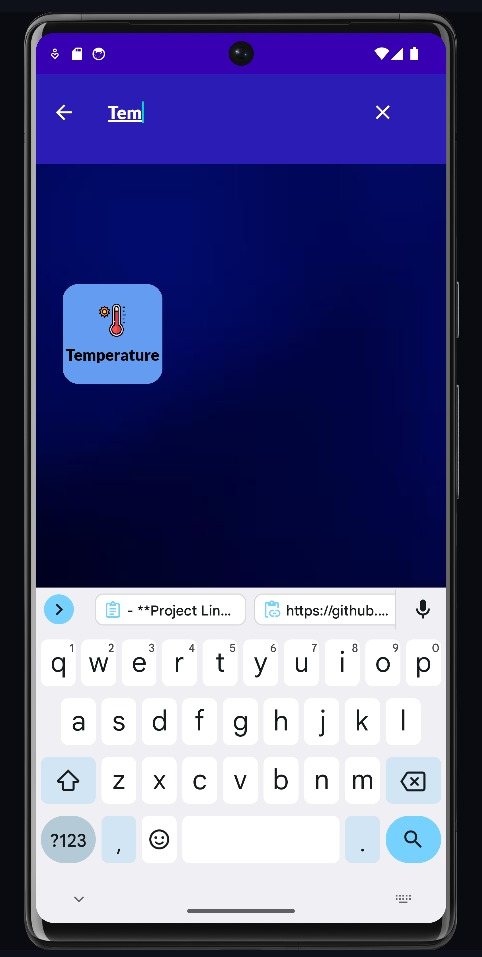

# Unit Converter App


<div style="text-align: center;">


    <h2>Unit Converter</h2>  
        <p><strong>Made By Vighnesh Salunkhe!</strong></p>
  
</div>

## Overview

The Unit Converter App is a simple and intuitive Android application designed to convert various units of measurement. This project was developed as part of my internship and aims to provide users with an easy way to perform conversions between different units.

## Features

- **Supports multiple unit types**: Length, Weight, Temperature, etc.
- **User-friendly interface**: Simple design for easy navigation.
- **Real-time conversion**: Instant feedback as users input values.
- **Search functionality**: Quickly find the unit you want to convert.
- **Custom themes**: A visually appealing design with different themes.

## Technologies Used

- Android Studio
- Java
- XML for layout design

## Output Screenshots
<div style="display: flex; justify-content: center; flex-wrap: wrap; gap: 10px;">
    
    
    
    
    
</div>

## Video Demo
Watch the video for a demonstration of the app in action:
[Click to Watch Demo](Video/recording.mp4)


## Installation

1. Clone the repository:
   ```bash
   git clone https://github.com/yourusername/unit-converter-app.git


2. Open the project in Android Studio.
3. Build and run the app on an Android device or emulator.

## Usage
1. Open the app.
2. Select the type of conversion you want to perform.
3. Input the value you wish to convert.
4. View the converted value instantly.

## Contributing
Contributions are welcome! If you have suggestions for improvements or new features, feel free to fork the repository and submit a pull request.

## License
This project is licensed under the MIT License. See the LICENSE file for details.

## Acknowledgments
- Thank you to my mentors for their guidance during this project.
- Inspiration from various online resources and tutorials.

## Contact
**For any inquiries, please reach out to me at:**

- **Email:** vighneshsalunkhe949@gmail.com
- **Project Link:** https://github.com/VighneshDevHub/Unit-Converter-App
